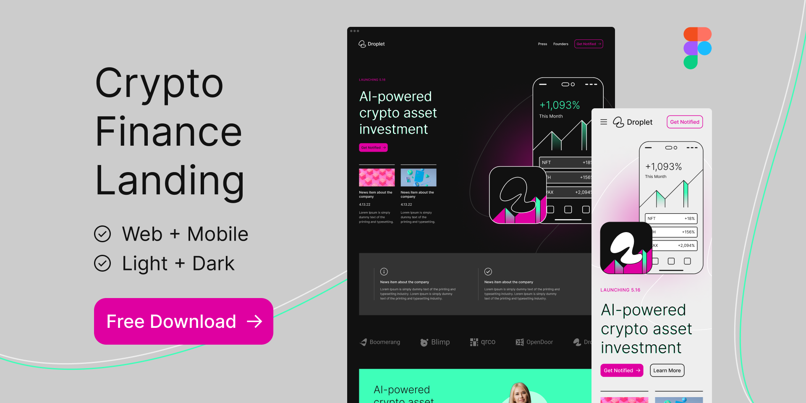

# Desafio 1 - Landing Page > Somente layout
 

 

> O objetivo é criar uma landing page usando HTML5, CSS3 e JavaScript, neste primeiro momento somente crição do layout sem funcionalidades.

 

## 📝 Figma

<a href="https://www.figma.com/file/d31jn4Tmtgvb5ljCzvABh1/Crypto-App-Finance-Landing---Free-Figma-Web-Page-for-Startups---Web%2FMobile---Light%2FDark-(Community)?node-id=7%3A173" target="_blank">Layout do projeto</a>

 

## 💻 Pré-requisitos

Antes de começar,

- Analise o que precisa ser feito.
- Tente criar uma lista de taferas do que precisa desenvolver.
- Tente estruturar o projeto em pastas
- Use os comandos do git

 

## ⏰ Tempo para desenvolvimento

Normalmente quando vamos desenvolver, analisamos o que precisa ser feito e estimamos quanto tempo vai levar para desenvolver,  
mas como estamos iniciando, o que acha desse primeiro desafio colocarmos um prazo de 3 semanas?

 

## ☕ Desenvolvimento

- HTML5
- CSS3
- Javascript
